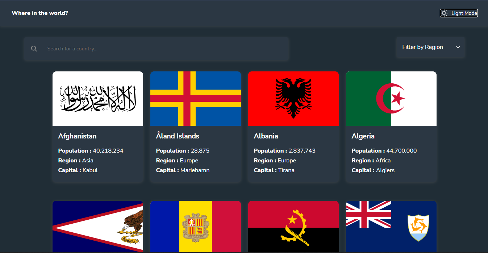

# Frontend Mentor - REST Countries API with color theme switcher solution

This is a solution to the [REST Countries API with color theme switcher challenge on Frontend Mentor](https://www.frontendmentor.io/challenges/rest-countries-api-with-color-theme-switcher-5cacc469fec04111f7b848ca). Frontend Mentor challenges help you improve your coding skills by building realistic projects. 

## Table of contents

- [Overview](#overview)
  - [The challenge](#the-challenge)
  - [Screenshot](#screenshot)
  - [Links](#links)
- [My process](#my-process)
  - [Built with](#built-with)
  - [What I learned](#what-i-learned)
  - [Continued development](#continued-development)
  - [Useful resources](#useful-resources)
- [Author](#author)
- [Acknowledgments](#acknowledgments)

## Overview

### The challenge

Users should be able to:

- See all countries from the API on the homepage
- Search for a country using an `input` field
- Filter countries by region
- Click on a country to see more detailed information on a separate page
- Click through to the border countries on the detail page
- Toggle the color scheme between light and dark mode *(optional)*

### Screenshot

- Solution URL: [GITHUB](https://github.com/TonniPaul/Country-Data)
- Live Site URL: [LIVE SITE](http://country-data.tonnipaul.com/)

## My process

### Built with

- Semantic HTML5 markup
- CSS custom properties
- Flexbox
- CSS Grid
- Mobile-first workflow
- [React](https://reactjs.org/) - JS library
- [TypeScript](https://www.typescriptlang.org/) - TypeScript 

### What I learned

- I learnt How to use state In TypeScript.
- How do make use of the "useParam" hook to route from mapped item 
- How to make use of the "useNavigate" hook to navigate to previous page

### Continued development

I intend to continue building more projects using typescript.

### Useful resources

- [How to Route from mapped list](https://app.pluralsight.com/guides/react-router-typescript) - This helped me with understanding how to route with react from a mapped list with using the useParam Hook.

## Author

- Website - [Paul Oluwatoni Ariyo-Adeoye](https://www.your-site.com)
- Frontend Mentor - [@tonnipaul](https://www.frontendmentor.io/profile/tonnipaul)
- Twitter - [@tonnipaul](https://www.twitter.com/tonnipaul)

